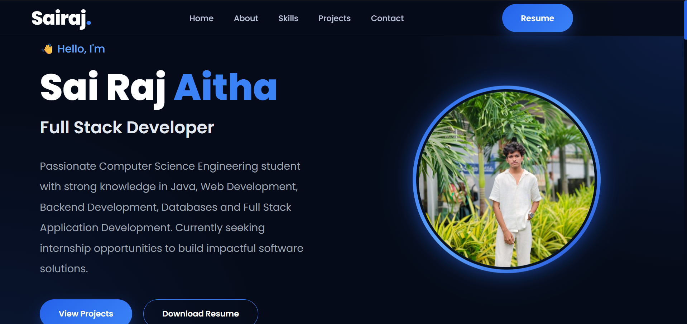
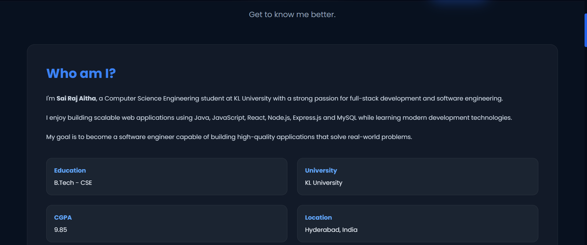
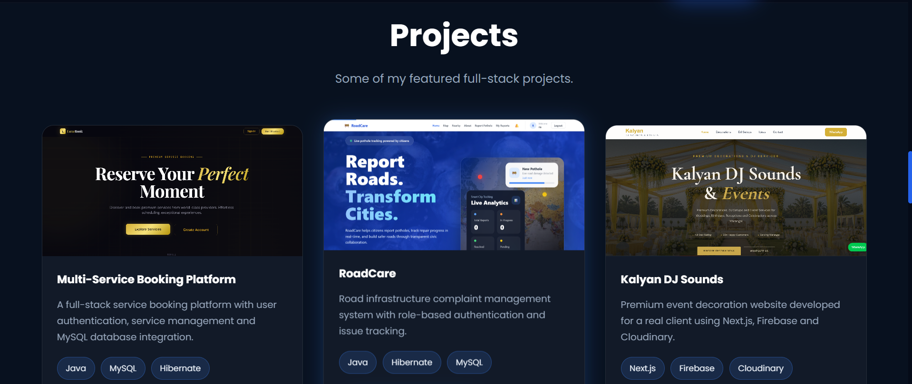
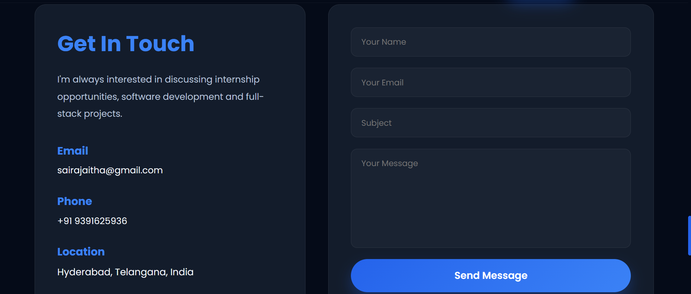

# 🚀 Thiranex Portfolio Task

Personal Portfolio Website developed as part of the **Thiranex Full Stack Development Internship – Task 1**.

---

## 📌 Features

- Responsive Portfolio Website
- Modern Dark UI
- About Me Section
- Skills Showcase
- Projects Section
- Contact Form
- React + Vite

---

## 🛠 Tech Stack

- React.js
- Vite
- HTML5
- CSS3
- JavaScript

---

## 📷 Screenshots

### Hero Section

---

### About & Skills

---

### Projects

---

### Contact

---

## 👨‍💻 Author

**Sai Raj Aitha**

GitHub:
https://github.com/Sairaj113113

LinkedIn:
https://www.linkedin.com/in/sairaj-aitha
